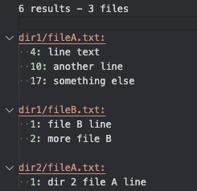
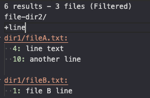

This extension allows you to filter results in the Search Editor.
You can add your searches after the search results summary line, but before the first file results.

## Search Format
| Line Prefix | Description | Example |
| - | - | - |
| + | Include results that exactly match word or phrase after plus symbol. | `+some text` will filter to lines that include "some text". |
| - | Exclude results that exactly match word or phrase after minus symbol. | `-some text` will filter to lines that do NOT include "some text". |
| file+ | Include results **from files** whose name exactly matches the word or phrase. | `file+.php` will filter to file names that include ".php". |
| file- | Exclude results **from files** whose name exactly matches the word or phrase. | `file-.php` will filter to file names that do NOT include ".php". |

## Example
**Original Search Results**

**Filtered Search Results**

